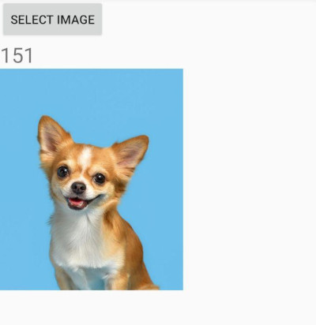
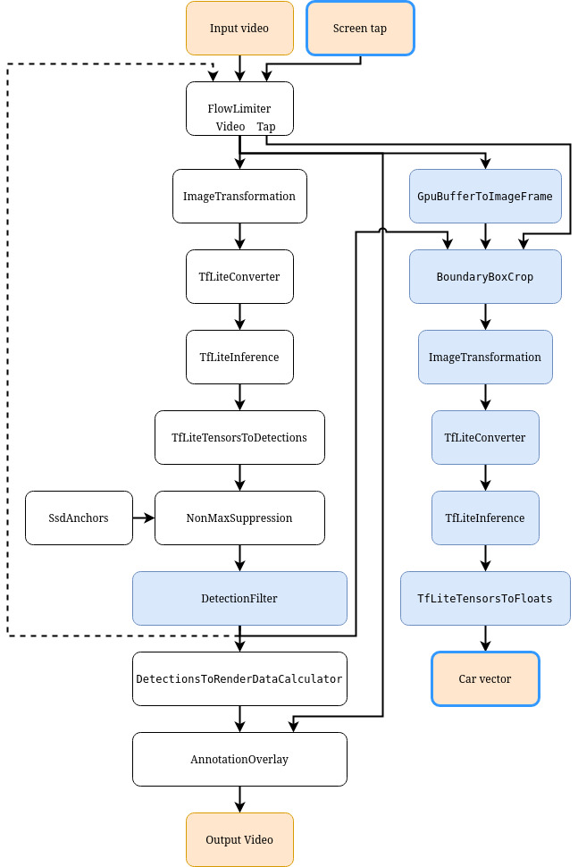

# Содержание

1. Введение
1. Обзор системы сборки Bazel
1. Фреймворк Mediapipe
    1. Что такое Mediapipe. Из чего состоит и зачем нужен.
    1. HelloWorld приложение на Mediapipe
    1. Запуск модели с помощью Mediapipe
1. Создание приложение с помощью Mediapipe
1. Заключение


# Введение 
Мотивация, класс приложений и т.д.

# Обзор системы сборки Bazel

В mediapipe для сборки используется Bazel. Я столкнулся с этой системой сборки впервые, поэтому параллельно с Mediapipe разбирался c Bazel, собирая информацию с разных источников и наступая на грабли. Поэтому, перед тем, как рассказать о самом Mediapipe, мне хотелось бы дать небольшое введение по системе сборки Bazel, которая используется в фреймворке и с которой я столкнулся впервые. Bazel - система сборки от Google, доработанная версия их внутренней системы сборки Blaze, выложенная в общий доступ. Bazel позволяет в одном проекте объединять различные языки и фреймворки простой командой:

`bazel build TARGET`

Как система сборки понимает, какой именно инструмент необходимо использовать для того или иного таргета? Для начала необходимо понять, из чего складывается Bazel-проект. Главным файлом проекта является текстовый файл WORKSPACE, в котором указываются все зависимости проекта. Говоря обо всех зависимостях, подразумеваются транзитивные зависимости тоже. Иными словами, если проект зависит от A, который зависит от B, то необходимо будет указать в WORKSPACE файле как зависимость от A, так и от B. Из-за этого WORKSPACE может сильно разрастаться, что можно будет заметить в дальнейшем примере работы с Mediapipe. Разработчики Bazel объясняют такое решение тем, что при изменении у зависимостей проекта их зависимостей, которые используются в проекте, проект может ломаться и искать проблему становится очень сложно, поэтому требуется явно указать всё, от чего зависит проект. Вот как может выглядить пример файла WORKSPACE:

```python
# Загрузка правила для получения зависимостей скачиванием
load("@bazel_tools//tools/build_defs/repo:http.bzl", "http_archive")

# Скачивание зависимости с набором правил для сборки c++
http_archive(
    name = "rules_cc",
    strip_prefix = "rules_cc-master",
    urls = ["https://github.com/bazelbuild/rules_cc/archive/master.zip"],
)

# Скачивание зависимости googletest
http_archive(
    name = "com_google_googletest",
    strip_prefix = "googletest-master",
    urls = ["https://github.com/google/googletest/archive/master.zip"],
)
```

Как видно из примера, файл состоит из правил (bazel rule). Каждое из этих правил - функция на языке Starlark. В этом и заключается расширяемость и универсальность Bazel. С помощью правил можно добавлять в систему сборки новые возможности, новые языки. Например, в указанном выше примере сначала загружается правило http_archive для загрузки зависимостей, а затем с помощью http_archive загружается набор правил для сборки C++ проектов и библиотека googletest.

Помимо файла WORKSPACE любой Bazel проект содержит некоторое количество файлов BUILD. BUILD файл описывает директорию, в которой он находится, как модуль и содержит описание таргетов для сборки. Вот так выглядит BUILD файл для сборки C++ проекта с одним файлом:

```python
cc_binary(
    name="HelloWorld",
    srcs=["main.cpp"],
    copts=["-Wall", "-Wpedantic", "-Werror"]
)
```

Здесь используется единственное правило, которое было загружено в файле WORKSPACE с помощью http_archive, создающее таргет для сборки. Пусть проект состоит из трех файлов:

* ./WORKSPACE
* ./Source/BUILD
* ./Source/main.cpp

Для сборки этого проекта достаточно выполнить команду

`bazel build //Source:HelloWorld`

Source - модуль, HelloWorld - таргет.

Правило вызовет cmake, результат сборки(исполняемый файл) будет расположен в ./bazel-bin.

Добавлять всё зависимости и исходники таргета одно правило часто может быть затруднительно, правила могут разрастаться и быть трудноподдерживаемыми, а также много кода может дублироваться. Для решения данной проблемы в Bazel есть библиотеки (libraries). 

```python
cc_library(
    name = "lib",
    hdrs = ["utils.h"],
    srcs = ["utils.cpp"],
    visibility = [
        "//visibility:public",
    ],
)

cc_binary(
    name="HelloWorld",
    srcs=["main.cpp"],
    deps=[":lib"],
    copts=["-Wall", "-Wpedantic", "-Werror"]
)
```

Библиотеки могут располагаться как в одном BUILD файле, так и в разных модулях или в разных проектах. Чтобы указать зависимость от модуля в другом проекте, необходимо до // написать название проекта

`@some_repository//Module:lib`

Bazel содержит набор встроенных правил, подходящих для большинства случаев. Помимо http_archive, зависимости можно добавлять с помощью git_repository, local_repository и др.


# Обзор Mediapipe

## Что такое Mediapipe

Mediapipe - кроссплатформенный фреймворк для запуска пайплайнов машинного обучения. Сам пайплайн задается в форме графа, граф состоит из следующих компонент (в скобках указывается оригинальный термин):

1. Вершины графа (Calculators) - некоторые преобразования. Представляют из себя C++ класс, реализующий интерфейс CalculatorBase, состоящий из следующих функций:
* `static Status GetContract(CalculatorContract*);` - статический метод, в котором калькулятор описывает форматы данных, которые ждет на вход и готов отдать на выход.
* `Status Open(CalculatorContext*);` - инициализация калькулятора при создании графа. Здесь, например, может быть загрузка данных, требуемых для работы.
* `Status Process(CalculatorContext*);` - обработка поступившего пакета.
* `Status Close(CalculatorContext*);` - закрытие вершины.

У каждого калькулятора должен быть как минимум один входящий и как минимум один исходящий поток.

2. Ребра графа (Streams) задают связи между калькуляторами. С помощью потоков по графу перемещаются пакеты с данными. Поток может быть внутренний, входной (input) и исходящий (output). Внутренний поток соединяет два калькулятора, по входному потоку из внешнего кода в граф попадают данные, а с помощью исходящего потока граф отправляет данные наружу, в вызывающий код.

3. Пакет (Packet) - единица данных, перемещаемая по графу и обрабатываемая калькулятором. Каждый пакет несёт в себе данные определенного типа - это может быть строка, целое число, массив чисел с плавающей запятой или пользовательский тип, описанный и сериализуемый в protobuf. Каждый пакет содержит в себе timestamp - отметку времени, ассоциированную с пакетом. Необходима для того, чтобы отличать, какой пакет был раньше, какой позже, напрямую с реальным временем не связано.

Графы описываются в формате protobuf. TODO?

Фреймворк позволяет из калькуляторов составлять необходимый пайплайн для инференса модели, а затем просто встраивать ее в приложения на разных платформах. Сейчас разработчики заявляют о поддержке нескольких дистрибутивов Linux, WSL, MacOS, Android, iOS. Вместе с фреймворком поставляется tflite для запуска моделей. Поддержки других фреймворков машинного обучения сейчас нет, но так как можно создавать собственные калькуляторы и встраивать их в граф, то возможность добавления поддержки других фреймворков есть.

Далее на примерах показано, как использовать Mediapipe. Здесь будут разобраны самые примитивные примеры, показывающие решение упрощенных учебных задач. Более сложные и практические примеры есть в репозитории Mediapipe, но разбираться с нуля по ним может быть сложно, полезно начинать с чего-то максимально простого.

## HelloWorld приложение на Mediapipe

Для начала можно рассмотреть самый простой граф, состоящий из одного узла, который повторяет N раз пакет, полученный на вход.


Для такого графа конфигурация выглядит следующим образом:

```
input_stream: "in"
output_stream: "out"

node {
    calculator: "RepeatNTimesCalculator"
    input_stream: "in"
    output_stream: "OUTPUT_TAG:out"
    node_options: {
        [type.googleapis.com/mediapipe_demonstration.RepeatNTimesCalculatoOptions] {
            n: 3
        }
    }
}
```

Калькулятор RepeatNTimesCalculator необходимо написать самостоятельно.

```C++
class RepeatNTimesCalculator : public mediapipe::CalculatorBase {
public:
    static mediapipe::Status GetContract(mediapipe::CalculatorContract* cc) {
        // На вход ожидается поток без тега с пакетами, содержащими строки
        cc->Inputs().Get("", 0).Set<std::string>();
        // Из калькулятора выходит поток с тегом OUTPUT_TAG, в котором пакеты со строками
        cc->Outputs().Get("OUTPUT_TAG", 0).Set<std::string>();
        return mediapipe::OkStatus();
    }

    mediapipe::Status Open(mediapipe::CalculatorContext* cc) final {
        // Загрузка параметров калькулятора, указанных при описании графа
        const auto& options = cc->Options<mediapipe_demonstration::RepeatNTimesCalculatoOptions>();
        // n - количество повторений входного сигнала на выходе
        n_ = options.n();
        return mediapipe::OkStatus();
    }

    mediapipe::Status Process(mediapipe::CalculatorContext* cc) final {
        // Получение текста из входного пакета
        // Из массива входных потоков берется поток без тега с нулевым индексом
        // И из него достается содержимое типа std::string
        auto txt = cc->Inputs().Index(0).Value().Get<std::string>();

        for (int i = 0; i < n_; ++i) {
            // Создание пакета с содержимым из входного
            auto packet = mediapipe::MakePacket<std::string>(txt).At(cc->InputTimestamp() + i);
            // Отправка пакета по потоку с тегом OUTPUT_TAG и индексом 0
            cc->Outputs().Get("OUTPUT_TAG", 0).AddPacket(packet);
        }
        
        return mediapipe::OkStatus();
    }
private:
    int n_;
};
// Макрос для регистрации калькулятора
REGISTER_CALCULATOR(RepeatNTimesCalculator);
```

Помимо самого кода калькулятора необходимо определить proto-файл с конфигурацией калькулятора. В данном примере это RepeatNTimesCalculatoOptions, который используется для указания того, сколько раз необходимо повторить входной сигнал на выходе.

```
syntax = "proto2";
package mediapipe_demonstration;
import "mediapipe/framework/calculator_options.proto";
message RepeatNTimesCalculatoOptions {
  extend mediapipe.CalculatorOptions {
    optional RepeatNTimesCalculatoOptions ext = 350607623;
  }
  required int32 n = 2;
}
```

Теперь необходимо запустить полученный граф

```C++
mediapipe::Status RunGraph() {
    // Загрузка графа из файла
    std::ifstream file("./hello-world/graph.pbtxt");
    std::string graph_file_content;
    graph_file_content.assign(
        std::istreambuf_iterator<char>(file), 
        std::istreambuf_iterator<char>());
    mediapipe::CalculatorGraphConfig config = 
        mediapipe::ParseTextProtoOrDie<mediapipe::CalculatorGraphConfig>(graph_file_content);
    // Инициализация графа
    mediapipe::CalculatorGraph graph;
    MP_RETURN_IF_ERROR(graph.Initialize(config));
    // Подписка на выходной поток
    ASSIGN_OR_RETURN(mediapipe::OutputStreamPoller poller, graph.AddOutputStreamPoller("out"));
    // Запуск графа
    MP_RETURN_IF_ERROR(graph.StartRun({}));
    // Отправка пакета на вход и закрытие входного потока
    auto input_packet = mediapipe::MakePacket<std::string>("Hello!").At(mediapipe::Timestamp(0));
    MP_RETURN_IF_ERROR(graph.AddPacketToInputStream("in", input_packet));
    MP_RETURN_IF_ERROR(graph.CloseInputStream("in"));
    // Получение пакета на выходе
    mediapipe::Packet packet;
    while (poller.Next(&packet)) {
        std::cout << packet.Get<std::string>() << std::endl;
    }
    return graph.WaitUntilDone();
}
```

Теперь, чтобы собрать всё воедино, необходимо написать BUILD файл с набором правил сборки для файла настроек калькулятора, исходного кода калькулятора и вызывающего кода

```python
load("@mediapipe_repository//mediapipe/framework/port:build_config.bzl", "mediapipe_cc_proto_library")
# Правило сборки для настроек калькулятора
proto_library(
    name = "repeat_n_times_calculator_proto",
    srcs = ["RepeatNTimesCalculator.proto"],
    visibility = ["//visibility:public"],
    deps = [
        "@mediapipe_repository//mediapipe/framework:calculator_proto",
    ],
)
# Правило сборки для кода калькулятора
mediapipe_cc_proto_library(
    name = "repeat_n_times_calculator_cc_proto",
    srcs = ["RepeatNTimesCalculator.proto"],
    cc_deps = [
        "@mediapipe_repository//mediapipe/framework:calculator_cc_proto",
    ],
    visibility = ["//visibility:public"],
    deps = [":repeat_n_times_calculator_proto"],
)
# Правило сборки калькулятора. Указано название, список исходников и зависимости
cc_library(
    name = "repeat_n_times_calculator",
    srcs = ["RepeatNTimesCalculator.cpp"],
    visibility = [
        "//visibility:public",
    ],
    deps = [
        ":repeat_n_times_calculator_cc_proto",
        "@mediapipe_repository//mediapipe/framework:calculator_framework",
        "@mediapipe_repository//mediapipe/framework/port:status",
    ],
    alwayslink = 1,
)
# Правило сборки исполняемого файла, который будет запускать граф.
cc_binary(
    name = "HelloMediapipe",
    srcs = ["main.cpp"],
    deps = [
        "repeat_n_times_calculator",
        "@mediapipe_repository//mediapipe/framework/port:logging",
        "@mediapipe_repository//mediapipe/framework/port:parse_text_proto",
        "@mediapipe_repository//mediapipe/framework/port:status",
    ],
)
```

Теперь можно собрать и запустить код:

```
$ bazel-2.0.0 build --define MEDIAPIPE_DISABLE_GPU=1 //hello-world:HelloMediapipe
...
INFO: Build completed successfully, 4 total actions
$ ./bazel-bin/hello-world/HelloMediapipe
Hello!
Hello!
Hello!
```

Данный пример демонстрирует пример запуска графа Mediapipe, однако не имеет отношения к запуску ML моделей.

## Запуск модели с помощью Mediapipe

Теперь рассмотрим, как с помощью Mediapipe запускать инференс моделей на разных устройствах. Дана обученная сеть, сконвертированная в tflite формат, обученная на ImageNet и классифицирующая на 1000 классов. Требуется написать программу для десктопа и смартфона (Android), запускающую данную сетку и выполняющую классификацию переданной фотографии. Пайплайн для запуска такого приложения можно собрать из стандартных калькуляторов, вот как он будет выглядеть:


```
input_stream: "in"
output_stream: "out"
node: {
  calculator: "ImageTransformationCalculator"
  input_stream: "IMAGE:in"
  output_stream: "IMAGE:transformed_input"
  node_options: {
    [type.googleapis.com/mediapipe.ImageTransformationCalculatorOptions] {
      output_width: 224
      output_height: 224
    }
  }
}
node {
  calculator: "TfLiteConverterCalculator"
  input_stream: "IMAGE:transformed_input"
  output_stream: "TENSORS:image_tensor"
  node_options: {
      [type.googleapis.com/mediapipe.TfLiteConverterCalculatorOptions] {
        zero_center: false
      }
  }
}
node {
  calculator: "TfLiteInferenceCalculator"
  input_stream: "TENSORS:image_tensor"
  output_stream: "TENSORS:prediction_tensor"
  node_options: {
    [type.googleapis.com/mediapipe.TfLiteInferenceCalculatorOptions] {
      model_path: "inference/mobilenetv2_imagenet.tflite"
    }
  }
}
node {
  calculator: "TfLiteTensorsToFloatsCalculator"
  input_stream: "TENSORS:prediction_tensor"
  output_stream: "FLOATS:out"
}
```

Граф содержит 4 узла: 

1. Изменение размера входного изображения на 224x224. Изображение можно отдать в приложение какого угодно размера, но сеть ожидает 224x224.
1. Нормализация на диапазон [-1, 1] (параметр калькулятора zero_center: false, по умолчанию нормализация проводится на [0, 1]), а затем преобразование из изображения в tf тензор.
1. Запуск модели.
1. Преобразование выходного тезнора в вектор чисел. Вектор предсказаний будет отдан вызывающему коду.

Теперь достаточно запустить граф и отправить в него данные, т.к. все части составленного графа уже реализованы.

Запуск графа на десктопе похож на рассмотренный пример выше. Разница в предобработке входных данных и постобработке выходных. Ниже представлен код, загружающий фотографию, отправляющий ее в граф и выводящий индекс наиболее вероятного класса:

```C++
// Загрузка изображения
auto img_mat = cv::imread("./inference/img.jpg");
// Преобразование изображения в пакет
auto input_frame = std::make_unique<mediapipe::ImageFrame>(
    mediapipe::ImageFormat::SRGB, img_mat.cols, img_mat.rows,
    mediapipe::ImageFrame::kDefaultAlignmentBoundary);
cv::Mat input_frame_mat = mediapipe::formats::MatView(input_frame.get());
img_mat.copyTo(input_frame_mat);
auto frame = mediapipe::Adopt(input_frame.release()).At(mediapipe::Timestamp(0));
// Отправка пакета в граф
MP_RETURN_IF_ERROR(graph.AddPacketToInputStream("in", frame));
MP_RETURN_IF_ERROR(graph.CloseInputStream("in"));
// Получение результата их графа с выводом предсказания
mediapipe::Packet packet;
while (poller.Next(&packet)) {
    auto predictions = packet.Get<std::vector<float>>();
    int idx = std::max_element(predictions.begin(), predictions.end()) - predictions.begin();
    std::cout << idx << std::endl;
}
```

Теперь можно запустить код и проверить, что изображено на фотографии


```
$ bazel-2.0.0 build --define MEDIAPIPE_DISABLE_GPU=1 //inference/desktop:Inference
...
INFO: Build completed successfully, 3 total actions
$ ./bazel-bin/inference/desktop/InferenceINFO: Initialized TensorFlow Lite runtime.
151
```

151 метка в ImageNet соответствует "Chihuahua"

Теперь необходимо добиться того же поведения на смартфоне. Необходимо написать вызывающий код в Activity

```kotlin
class MainActivity : AppCompatActivity() {
    val PICK_IMAGE = 1
    var mpGraph: Graph? = null
    var timestamp = 0L
    override fun onCreate(savedInstanceState: Bundle?) {
        super.onCreate(savedInstanceState)
        this.setContentView(R.layout.activity_main)
        val outputTv = findViewById<TextView>(R.id.outputTv)
        val button = findViewById<Button>(R.id.selectButton)
        AndroidAssetUtil.initializeNativeAssetManager(this)
        // Загрузка и инициализация графа
        // В данном случае граф преобразуется в бинарный формат
        val graph = Graph()
        assets.open("mobile_binary_graph.binarypb").use {
            val graphBytes = it.readBytes()
            graph.loadBinaryGraph(graphBytes)
        }
        // Подписка на выходной поток
        graph.addPacketCallback("out") {
            val res = PacketGetter.getFloat32Vector(it)
            val label = res.indices.maxBy { i -> res[i] } ?: -1
            this@MainActivity.runOnUiThread {
                outputTv.text = label.toString()
            }
        }
        graph.startRunningGraph()
        // Кнопка для выбора изображения из галереи
        button.setOnClickListener {
            val intent = Intent()
            intent.type = "image/*"
            intent.action = Intent.ACTION_GET_CONTENT
            startActivityForResult(Intent.createChooser(intent, "Select Picture"), PICK_IMAGE)
        }
        mpGraph = graph
    }
    override fun onActivityResult(requestCode: Int, resultCode: Int, data: Intent?) {
        if (requestCode == PICK_IMAGE) {
            // Получение выбранного изображения из галереи и его отрисовка
            val outputTv = findViewById<TextView>(R.id.outputTv)
            val imageView = findViewById<ImageView>(R.id.imageView)
            val uri = data?.data!!
            // Отправка изображения в граф
            val graph = mpGraph!!
            val creator = AndroidPacketCreator(graph)
            val stream = contentResolver.openInputStream(uri)
            val bitmap = BitmapFactory.decodeStream(stream)
            imageView.setImageBitmap(bitmap)
            val packet = creator.createRgbImageFrame(bitmap)
            graph.addPacketToInputStream("in", packet, timestamp)
        }
    }
    companion object {
        init {
            // Загрузка нативной mediapipe библиотеки
            System.loadLibrary("mediapipe_jni")
        }
    }
}
```

Сборка приложение и его загрузка на смартфон для отладки

```
$ bazel-2.0.0 mobile-install --start_app -c opt --config=android_arm64 //inference/android/src/main/java/com/mediapipe_demonstration/inference:Inference
```

В приложении можно выбрать фото из галереи и предсказать, что же на фотографии изображено:



Результат аналогичен.

В данном разделе приведены только участки кода, полный код примеров можно посмотреть на [github](https://github.com/MaximKsh/mediapipe_examples)

Более сложные и практические примеры расположены в [репозитории Mediapipe](https://github.com/google/mediapipe/tree/master/mediapipe/examples)

# Создание приложение с помощью Mediapipe

Теперь рассмотрим более практический пример. Представим сервис по распознаванию моделей автомобилей. Есть приложение, через которое можно сфотографировать авто и отправить на сервер. Есть сервер, который для присланной фотографии запускает модель классификации и отдает полученный результат на клиент. Количество пользователей растет, нагрузка на сервер тоже и требуется решать проблему производительности:

* Добавить еще мощности для сервера, докупить GPU, добавить несколько серверов.
* Перенести часть вычислений на клиент.

Выбираем второй вариант, для его реализации можно воспользоваться Mediapipe. Теперь приложение должно не только снимать автомобиль, но также находить в кадре и переводить его в некоторый вектор чисел, потому что передавать по сети 1000 чисел проще, чем целое изображение. Для этого потребуется две модели: модель детекции и модель для векторизации.

За основу приложения был взят пример для Mediapipe, решающий задачу детекции. Для получения вектора из фотографии взята сеть, обученная на ImageNet, далее дообучения на датасете из автомобилей. Векторное представление автомобиля получается из значений перед первым полносвязным слоем.

Полученный граф для приложения выглядит следующим образом:

  

Узлы на белом фоне были в оригинальном примере, узлы на голубом фоне добавлены.

Первоначальный граф находил в каждом кадре границы boundary box для объектов, а затем накладывал их на исходных кадр и отдавал вызывающему коду. Причем частота кадров ограничена скоростью работы модели, что реализовано с помощью FlowLimiter.

В первую очередь понадобилось добавить фильтр для результатов детекции, т.к. в результате работы модели может быть много различных классов, а в данном случае нужен только один. Для этого был написан калькулятор DetectionFilter, который на вход принимал массив детекшенов, а на выходе были только те, классы которых указаны в настройках узла в графе.

Выглядит это достаточно просто, метод Process калькулятора представлен ниже:

```C++
mediapipe::Status DetectionFilterCalculator::Process(mediapipe::CalculatorContext *cc) {
    const auto& input_detections = cc->Inputs().Get("", 0).Get<std::vector<::mediapipe::Detection>>();
    std::vector<::mediapipe::Detection> output_detections;
    for (const auto& input_detection : input_detections) {
        bool next_detection = false;

        for (int pass_id : pass_ids_) {
            for (int label_id : input_detection.label_id()) {
                if (pass_id == label_id) {
                    output_detections.push_back(input_detection);
                    next_detection = true;
                    break;
                }
            }
            if (next_detection) {
                break;
            }
        }
    }
    auto out_packet = mediapipe::MakePacket<std::vector<mediapipe::Detection>>(output_detections).At(cc->InputTimestamp());
    cc->Outputs().Get("", 0).AddPacket(out_packet);

    return mediapipe::OkStatus();
}
```

И в граф добавляется следующим образом:

```
node {
    calculator: "DetectionFilterCalculator"
    input_stream: "filtered_detections"
    output_stream: "car_detections"
    node_options: {
        [type.googleapis.com/objectrecognition.DetectionFilterCalculatorOptions] {
            pass_id: 3
        }
    }
}
```

Теперь пользователь на экране увидит только обнаруженные автомобили. Когда пользователь захочет узнать модель автомобиля, он нажимает по рамке, в которую автомобиль обведен.

TODO здесь скрин из приложения с автомобилем в рамке.

Информация о нажатии передается внутрь графа через входной поток ScreenTap, а затем попадает в узел BoundaryBoxCrop. Важно заметить, что пакеты из ScreenTap также проходят через FlowLimiter, хотя очевидно, что они приходят в граф гораздо реже, чем пакеты с кадрами видео из камеры. Это связано с тем, что входные потоки должны быть синхронизированы, иными словами, обработка пакетов начнется только тогда, когда на вход поступит кадр и информация о нажатии по экрану. Обнаружение данной особенности заняло некоторое время, потому что на практике это проявлялось в том, что через граф проходил только один кадр, а потом ни один узел не вызывался и в приложении был "черный экран". Решением данной проблемы стала синхронная отправка в граф пакета с кадром и пакета с информацией о нажатии. Чаще всего пакет с информацией о нажатии пустой, но в случае, когда пользователь нажимает на экран, то пакет заполняется координатами экрана (причем, в данной задаче удобнее, чтобы эти координаты были нормализованы в [0, 1]).

BoundaryBoxCrop на входе проверяет, что в пакет с информацией по нажатию не пустой. Если он не пустой, то из DetectionFilter берутся полученные рамки, из FlowLimiter берется текущий кадр, предварительно пересланный из GPU в CPU. Этой информации достаточно, чтобы определить, по какой рамке было произведено нажатие, а затем вырезать ее из общего кадра.

```C++
mediapipe::Status BoundaryBoxCropCalculator::Process(mediapipe::CalculatorContext *cc) {
    auto& detections_packet = cc->Inputs().Get("DETECTION", 0);
    auto& frames_packet = cc->Inputs().Get("IMAGE", 0);
    auto& click_packet = cc->Inputs().Get("CLICK", 0);

    if (detections_packet.IsEmpty()
        || frames_packet.IsEmpty()
        || click_packet.IsEmpty()) {
        return mediapipe::OkStatus();
    }

    const std::vector<mediapipe::Detection>& detections =
            detections_packet.Get<std::vector<mediapipe::Detection>>();
    const mediapipe::ImageFrame& image_frame = frames_packet.Get<mediapipe::ImageFrame>();

    // Java код записывает сериализованный protobuf как строку, поэтому его нужно вручную разбирать.
    auto click_location_str = click_packet.Get<std::string>();
    objectrecognition::ClickLocation click_location;
    click_location.ParseFromString(click_location_str);
    // Нажатия не было, выходим без дальнейшей обработки
    if (click_location.x() == -1 || click_location.y() == -1) {
        return mediapipe::OkStatus();
    }

    // Определение по какой рамке было нажатие
    absl::optional<mediapipe::Detection> detection = FindOverlappedDetection(click_location, detections);

    if (detection.has_value()) {
        // если нажатие было по рамке, то изображение внутри рамки вырезается
        std::unique_ptr<mediapipe::ImageFrame> cropped_image = CropImage(image_frame, detection.value());
        cc->Outputs().Get("", 0).Add(cropped_image.release(), cc->InputTimestamp());
    }

    return mediapipe::OkStatus();
}

absl::optional<mediapipe::Detection> BoundaryBoxCropCalculator::FindOverlappedDetection(
        const objectrecognition::ClickLocation& click_location,
        const std::vector<mediapipe::Detection>& detections) {
    for (const auto& input_detection : detections) {
        const auto& b_box = input_detection.location_data().relative_bounding_box();

        if (b_box.xmin() < click_location.x() && click_location.x() < (b_box.xmin() + b_box.width())
            && b_box.ymin() < click_location.y() && click_location.y() < (b_box.ymin() + b_box.height())) {
            return input_detection;
        }
    }

    return absl::nullopt;
}

std::unique_ptr<mediapipe::ImageFrame> BoundaryBoxCropCalculator::CropImage(
        const mediapipe::ImageFrame& image_frame,
        const mediapipe::Detection& detection) {
    const uint8* pixel_data = image_frame.PixelData();
    const auto& b_box = detection.location_data().relative_bounding_box();

    int height = static_cast<int>(b_box.height() * static_cast<float>(image_frame.Height()));
    int width = static_cast<int>(b_box.width() * static_cast<float>(image_frame.Width()));
    int xmin = static_cast<int>(b_box.xmin() * static_cast<float>(image_frame.Width()));
    int ymin = static_cast<int>(b_box.ymin() * static_cast<float>(image_frame.Height()));

    if (xmin < 0) {
        width += xmin;
        xmin = 0;
    }
    if (ymin < 0) {
        height += ymin;
        ymin = 0;
    }
    if (width > image_frame.Width()) {
        width = image_frame.Width();
    }
    if (height > image_frame.Height()) {
        height = image_frame.Height();
    }

    std::vector<uint8_t> pixels;
    pixels.reserve(height * width * image_frame.NumberOfChannels());
    for (int y = ymin; y < ymin + height; ++y) {
        int row_offset = y * image_frame.WidthStep();
        for (int x = xmin; x < xmin + width; ++x) {
            for (int ch = 0; ch < image_frame.NumberOfChannels(); ++ch) {
                pixels.push_back(pixel_data[row_offset + x * image_frame.NumberOfChannels() + ch]);
            }
        }
    }

    std::unique_ptr<mediapipe::ImageFrame> cropped_image = std::make_unique<mediapipe::ImageFrame>();
    cropped_image->CopyPixelData(image_frame.Format(), width, height, pixels.data(),
            mediapipe::ImageFrame::kDefaultAlignmentBoundary);

    return cropped_image;
}

```

После этого вырезанное изображение необходимо предобработать стандартными калькуляторами и запустить сеть для векторизации изображения. Что из себя представляет сеть было описано в начале этой части статьи.

Результат работы сети из tf тензора конвертируется в массив чисел и отправяется на выход из графа в вызывающий код.

Вызывающий код получает массив, отправляет его на сервер, который находит ближайший к нему среди "эталонных" векторов автомобилей и отвечает клиенту названием модели ближайшего вектора. Близость может определяться разными способами, в данном случае использовалось косинусное расстояние (косинус между двумя векторами).

Всё, что остается клиенту - это вывести пользователю результат распознавания. Вот как это выглядит на практике:

TODO здесь можно добавить гифку как это работает.

Итак, в результате получено приложение, выполняющее всю ресурсоемкую работу по детекции и распознаванию, а также простенький сервер, оперирующий только массивами чисел и их близостью. При этом по сети изображения в явном виде не передается, а передается более сжатое представление, что позволяет пользоваться сервисом при медленном соединении.

Представленное в данной статье является демонстрацией proof-of-concept, поэтому содержит множество недочетов и направлений для развития:

* Вырезание изображения и запуск сети для получения вектора выполняются на CPU, тогда как часть с детекцией, взятая из оригинального примера, выполняется на GPU. Перенос всего на GPU позволит ускорить выполнение и сэкономить на пересылках между CPU и GPU;
* Добавление трекинга и выполнение распознавания не по нажатию на рамку, а в реальном времени. Это добавит интерактивности и позволит распознавать несколько автомобилей одновременно.

# Заключение


Добавить описание форматов timestamp, string, protobuf.

Про линковку в базеле рассказать.

Больше текста.

Уменьшить apk